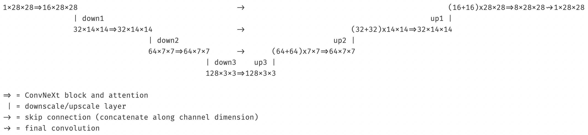

### Diffusion

<a target="_blank" href="https://colab.research.google.com/github/okarthikb/diffusion/blob/main/diffusion.ipynb">
  
</a>


This is a concise implementation of a diffusion model trained on MNIST using a ConvNeXt and attention-based U-Net (inspired by the 2020 DDPM paper) with DDIM sampling. I found [Hugging Face's explainer](https://huggingface.co/blog/annotated-diffusion) on diffusion models (based on [lucidrains's implementation](https://github.com/lucidrains/denoising-diffusion-pytorch)) a bit unfriendly for beginners, so here's a (hopefully) simpler implementation. I've also linked all the helpful resources I went through in the notebook :)

This is the U-Net architecture:



The forward and reverse diffusion processes are defined in a single `Sampler` class:

```python
class Sampler:
  def __init__(self, max_t, n_step, schedule, device, eta=1, shape=(1, 28, 28)):
    self.n_step = n_step
    self.device = device
    self.eta = eta
    self.shape = shape

    abar = schedule(max_t).to(device)
    self.abar = abar / abar[0]
    self.sqrt_abar = rearrange(self.abar.sqrt(), 'l -> l 1 1 1')
    self.sqrt_bbar = rearrange((1 - self.abar).sqrt(), 'l -> l 1 1 1')

    self.tau = torch.arange(0, max_t, max_t // n_step) + 1

  # forward diffusion process sampling
  def forward(self, x, t):
    eps = torch.randn_like(x, device=self.device)
    mu_t = self.sqrt_abar.index_select(0, t) * x
    noise_t = self.sqrt_bbar.index_select(0, t) * eps
    return mu_t + noise_t, eps

  # reverse diffusion process sampling loop
  @torch.no_grad()
  def loop(self, model, n_sample=1, classes=None):
    model.eval()

    if classes is not None:
      assert n_sample == len(classes), 'n_sample must equal batch size'

    x_t = torch.randn(n_sample, *self.shape, device=self.device)
    xs = [x_t]
    tau_b = repeat(self.tau, 'l -> l n', n=n_sample).to(self.device)

    for i in range(self.n_step - 1, 0, -1):

      bbar = 1 - self.abar[self.tau[i]]
      beta = 1 - self.abar[self.tau[i]] / self.abar[self.tau[i - 1]]
      beta = (beta * (1 - self.abar[self.tau[i - 1]]) / bbar).clip(0, 0.999)
      alpha = 1 - beta

      eps = model(x_t, tau_b[i], classes)
      x_t = alpha.rsqrt() * (x_t - beta * eps * bbar.rsqrt())

      if self.eta > 0:
        noise_t = beta.sqrt() * torch.randn_like(x_t, device=self.device)
        x_t += noise_t * eta ** 0.5

      xs.append(x_t)

    return xs
```

Here, `forward_sample` does one iteration in the training algorithm above and `loop` is the whole sampling algorithm.


